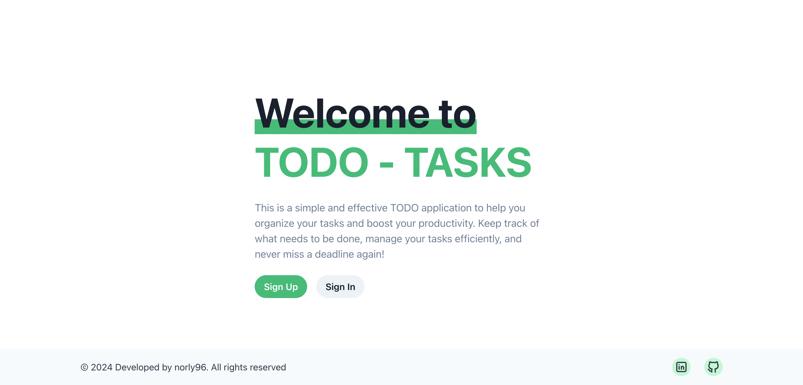
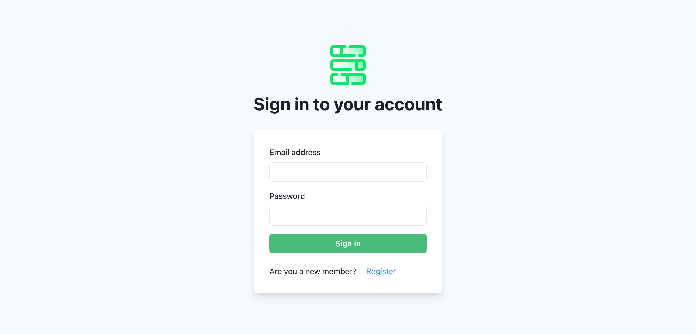
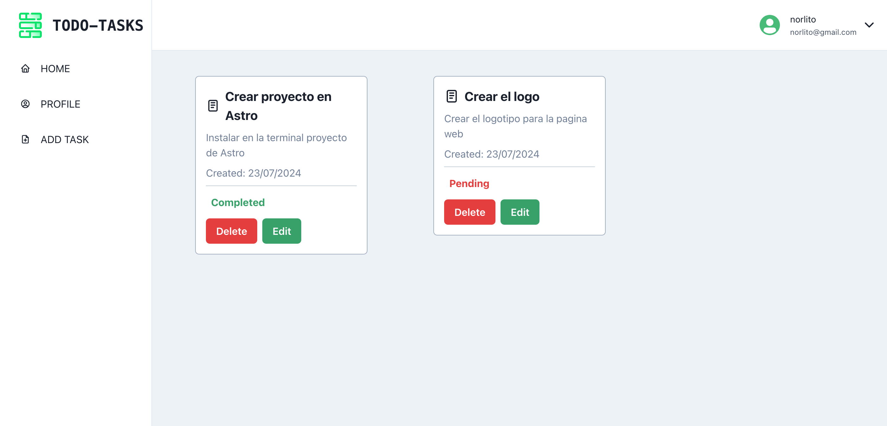

# TODO-Tasks

Todo-tasks is a web application that allows users to authenticate and manage their personal tasks. Each user can create, edit, delete, and view their tasks.

### Features

1. Authentication: User registration and login.
2. Task Management: Create, edit, delete, and view tasks.
3. User Interface: Built with React and TypeScript.
4. Backend: Built with Node.js, Express, and MongoDB.
5. Validation: Uses Zod for schema validation.

### Screenshot







### Links

Deploy by Vercel

- Site URL: [TODO-Tasks](https://https://todo-tasks-sigma.vercel.app/)

## Installation

To run this project on your local machine, follow these steps:

1. Clone the repository:

```bash
https://github.com/norly96/mern-tasks-frontend.git
```

2. Navigate to the project directory:

```bash
cd mern-tasks-frontend
```

3. Install the backend dependencies:

```bash
npm install
```

4. Set your environment variables. Create an .env file in the project root directory and add your TMDB API key:

```bash
VITE_API=https://mern-tasks-backend.vercel.app
```

5. Start the server

```bash
npm run dev
```

## Used technologies

1. HTML, CSS, TypeScript, ReactJS, Chakra UI, React-Hook-Form, React Router

## Contact

    Name: Norluis Galvez Sanchez
    GitHub: https://github.com/norly96
    Linkedin: https://www.linkedin.com/in/norly96
